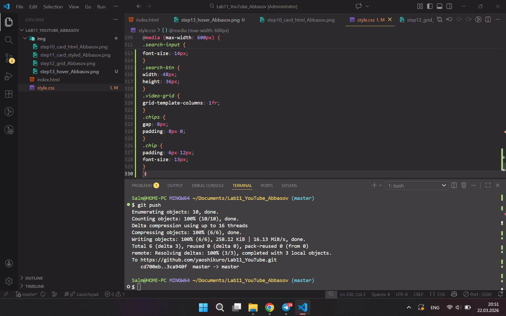
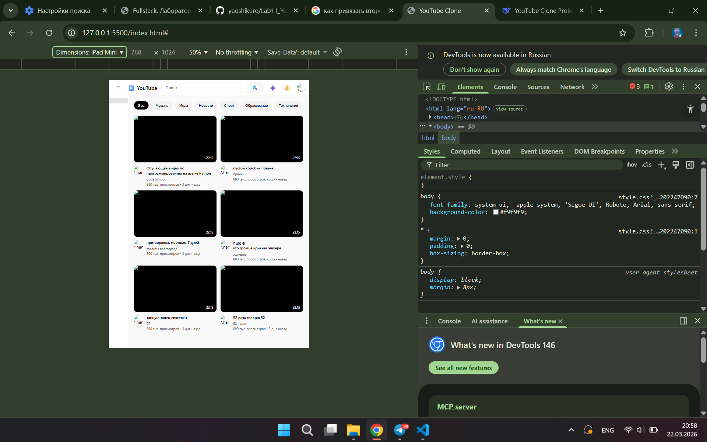
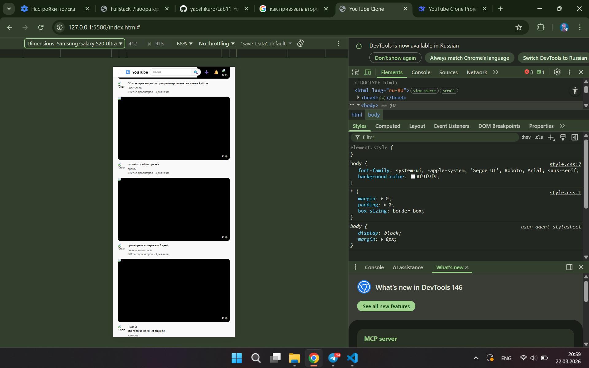

# YouTube Clone - Лабораторная работа №9-10
**Студент:** Аббасов Салман Сананович
**Группа:** ИСП-233
---
## Описание
на этой лабораторной работе мы научились применять свои новые заработанные навыки в деле создавая клон ютуба, используя Flexbox и CSS grid
---
## Реализованные функции
- [ ] Адаптивный хедер с поиском
- [ ] Боковая панель навигации
- [ ] Категории (чипсы) с интерактивностью
- [ ] Сетка видео с карточками
- [ ] Hover-эффекты на карточках
- [ ] Полная адаптивность под все устройства
---
## Технологии
- HTML5
- CSS3
- Flexbox
- CSS Grid
- Media Queries
---
## Скриншоты
### Desktop (1920px)

### Tablet (1024px)

### Mobile (375px)

---
## Как запустить
1. Откройте файл `index.html` в браузере
2. Или используйте **Live Server** в VS Code:
- Установите расширение Live Server
- Правой кнопкой по `index.html` → Open with Live Server
---
## Структура проекта
img/  index.html  README.MD  style.css

./img:
adaptiv_mobile.png  step10_card_html_Abbasov.png    step12_grid_Abbasov.png   step14_adaptiv_Abbasov.png
adaptiv_tablet.png  step11_card_styled_Abbasov.png  step13_hover_Abbasov.png
---
## Вывод
В ходе выполнения лабораторной работы я изучил основы адаптивной вёрстки,
освоил работу с Flexbox и CSS Grid, научился создавать интерактивные элементы с помощью CSS.
Проект помог мне лучше понять принципы создания современных веб-интерфейсов. И научился пиратить сайты просто на вид.
---
## Дата выполнения
24.03.2026